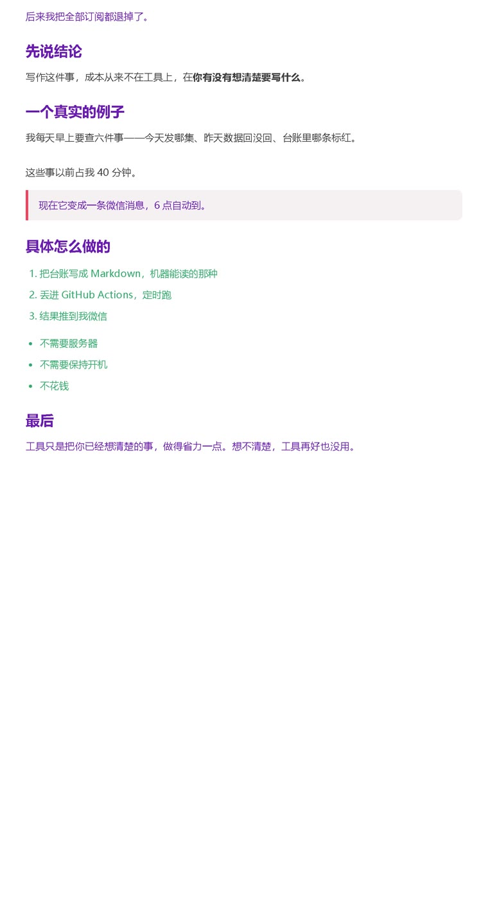

# 公众号排版工具

> 把 Markdown 一键转成公众号能直接粘贴的排版。图片自动内联，不用一张张后台上传。



<sub>上面这张是本工具用一段 Markdown 真实渲染出来的效果——紫色标题、红色引用块、绿色列表，全部自动生成，你只管写字。</sub>

写公众号最耗时间的不是想内容，是在后台一遍遍调标题颜色、分段空行、引用框、配图对齐。一篇 2000 字调完半小时，格式还容易乱。

这工具把你写好的 Markdown 直接转成公众号排版 HTML，点一下粘进后台就成型。

**不联网、不上传、不碰你的文件** —— 全程在你电脑本地跑，图也在你电脑上。

## 三十秒上手

1. **粘贴**：左边把写好的 Markdown 粘进去（或直接 Ctrl+V 打开 .md 文件）
2. **配图**：图片直接 **Ctrl+V 粘进编辑器**，自动存到文章同目录的 `images/` 并插好位置；也可以手动放进 `images/` 目录，正文写 `{{图}}` 占位
3. **复制**：点「复制排版」→ 去公众号后台 Ctrl+V 完事

主标题点「复制主标题」单独填到后台顶部栏。

## 它到底做了什么（这些是它真正的价值）

| 功能 | 说明 |
|------|------|
| **图片自动内联** | 图片转成 base64 直接嵌进 HTML，粘过去**不会丢图**（公众号后台对外链图片会拒绝，这是 90% 人手动排版最大的坑） |
| **粘贴即存图** | Ctrl+V 截图，自动落盘到 `images/` 并插到光标处，不用先存文件再引用 |
| **占位符自动配图** | 正文写 `{{图}}`，工具按顺序把 `images/` 里的图自动填进去 |
| **大图预警** | 单张超过阈值会提示"这张图太大，粘进后台可能糊"，别等发出去才发现 |
| **缺图预警** | 图找不到就标红提示路径，不会默默出一堆裂图 |
| **手机预览** | 生成 iPhone 尺寸预览图，发之前就能看真实效果 |
| **段落自动分拆** | 长段落按中文阅读节奏断开，手机上不憋屈 |
| **自动保存草稿** | 编辑过程存 `recent` 列表，关掉不丢稿 |
| **双份复制** | 同时给富文本和纯文本，粘哪儿都不变形 |

## 排版样式

不是随便堆的默认样式，是按公众号阅读体验调过的：

- 正文 `#3f3f3f`（不是纯黑，长文看着不累）、15px、1.8 行高、字间距 .3px
- 标题紫 `#6a1bb1`，四级递进
- 引用块：左侧 4px 红边 `#e94560` + 浅底 `#f5f0f2`
- 代码块：`#f6f8fa` 底 + 边框，像 GitHub 一样
- 链接：红色下划线，不是一串裸 URL
- 图片：`max-width:100%` + 8px 圆角 + 居中

## 手机预览

首次用会下载 Chromium 组件（约百来 MB，**只下这一次**，之后离线可用），耐心等几分钟。

## 懒人通道

把文章草稿丢给你的 AI 助手（ChatGPT / Claude / 豆包都行），让它帮你截好图、写好 `{{图}}` 占位符、排好 Markdown 结构，你最后只点一下「复制排版」。

## 不做什么

- **不联网**、不上传、不碰你任何文件
- **不做云同步**，没有账号系统，配置全在本地
- 仅支持 Windows，手机打不开，必须电脑运行

## 快速开始

### 下载即用（推荐）

去 [Releases](../../releases) 下载 `公众号排版.exe`，双击运行。不需装 Python，不需任何配置。

### 源码运行

```bash
pip install pillow playwright

# 手机预览需要，跳过也行
playwright install chromium

python wechat_formatter.py

# 或打包成 exe
pip install pyinstaller
pyinstaller 公众号排版.spec
```

**依赖只有两个**：Pillow（图片处理）、Playwright（手机预览截图）。都是开源的。

## 它和 video-factory 的关系

同一套工作流里的两个工具：这条流水线用 [video-factory](https://github.com/jiay123/video-factory) 做短视频，用这个做公众号图文。两个都开源，都不联网。

## License

MIT